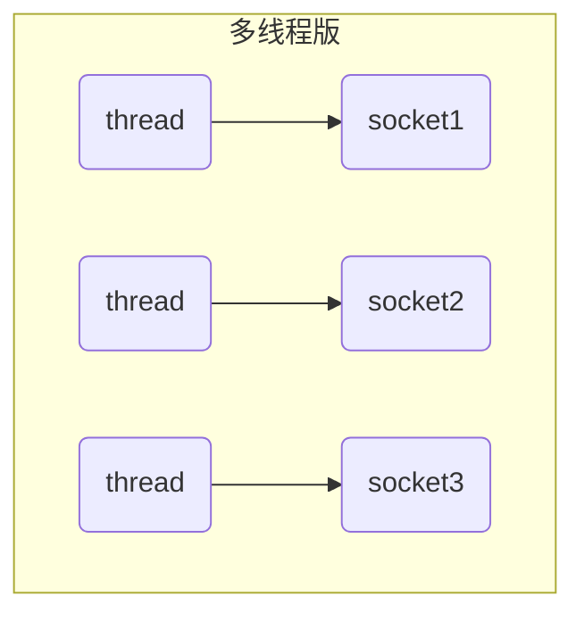
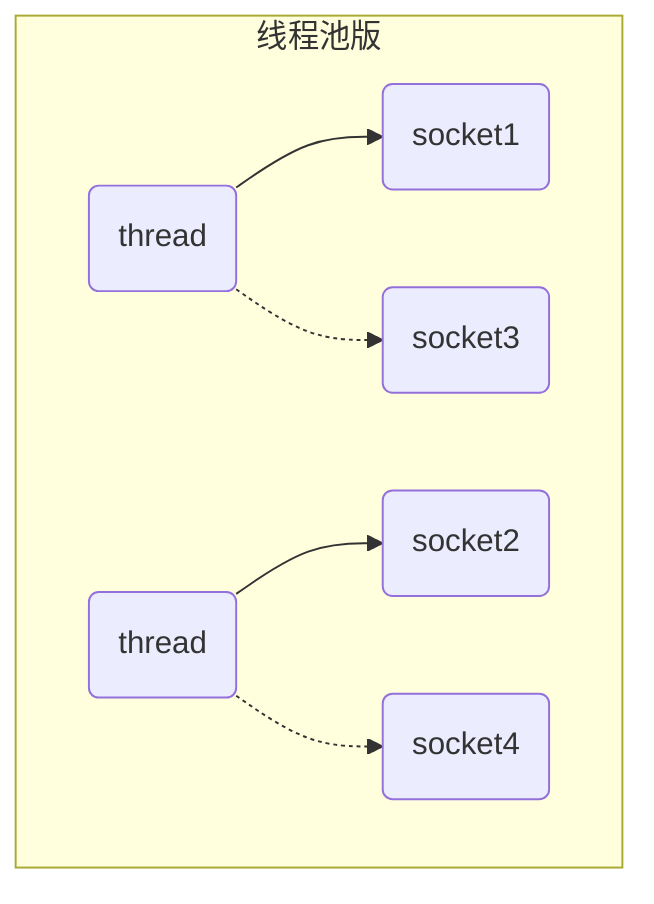
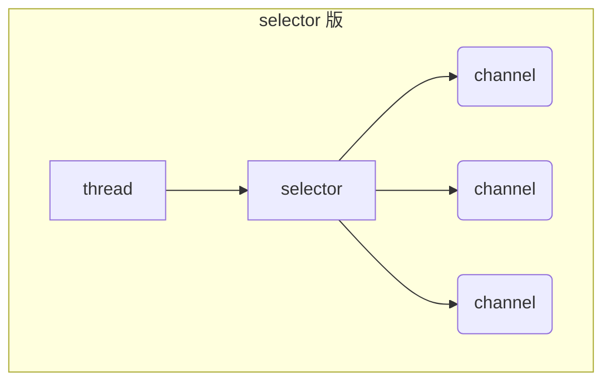

+++
title = "[Java]NIO"
date = "2024-07-10T20:54:34+08:00"
tags = ["Java","Netty"]

+++

[TOC]


# 一. NIO 基础

NIO non-blocking io 非阻塞 IO  

BIO blocking io 阻塞IO

## 0.流与块

Standard IO是对字节流的读写，在进行IO之前，首先创建一个流对象，流对象进行读写操作都是按字节 ，一个字节一个字节的来读或写。而NIO把IO抽象成块，类似磁盘的读写，每次IO操作的单位都是一个块，块被读入内存之后就是一个byte[]，NIO一次可以读或写多个字节。

I/O 与 NIO 最重要的区别是数据打包和传输的方式，I/O 以流的方式处理数据，而 NIO 以块的方式处理数据。

**面向流的 I/O** 一次处理一个字节数据：一个输入流产生一个字节数据，一个输出流消费一个字节数据。为流式数据创建过滤器非常容易，链接几个过滤器，以便每个过滤器只负责复杂处理机制的一部分。不利的一面是，面向流的 I/O 通常相当慢。

**面向块的 I/O** 一次处理一个数据块：按块处理数据比按流处理数据要快得多。但是面向块的 I/O 缺少一些面向流的 I/O 所具有的优雅性和简单性。


## 1. 三大组件

### 1.1 Channel & Buffer

channel （通道）有一点类似于 stream，它就是读写数据的**双向通道**，可以从 channel 将数据读入 buffer（缓冲区，用于存储数据的内存块，是NIO中的数据容器），也可以将 buffer 的数据写入 channel，而之前的 stream 要么是输入，要么是输出，channel 比 stream 更为底层。


常见的 Channel 有

* FileChannel：文件传输通道
* DatagramChannel：UDP时传输通道
* SocketChannel：TCP时传输通道，客户端服务器端都能用
* ServerSocketChannel：TCP时传输通道，服务器端


buffer 则用来缓冲读写数据，常见的 buffer 有

* **ByteBuffer**
  * MappedByteBuffer
  * DirectByteBuffer
  * HeapByteBuffer
* ShortBuffer
* IntBuffer
* LongBuffer
* FloatBuffer
* DoubleBuffer
* CharBuffer


### 1.2 Selector

选择器用于监控多个通道的IO事件，当一个或多个事件发生时，选择器会通知对应的通道进行处理。使用选择器可以实现单线程处理多个通道的IO操作，提高系统的并发性能。

selector（选择器） 单从字面意思不好理解，需要结合服务器的设计演化来理解它的用途

#### 多线程版设计



#### ⚠️ 多线程版缺点

* 内存占用高
* 线程上下文切换成本高
* 只适合连接数少的场景


#### 线程池版设计



#### ⚠️ 线程池版缺点

* 阻塞模式下，线程仅能处理一个 socket 连接
* 仅适合短连接场景（短连接指的是在数据传送过程中，只在需要发送数据时，才去建立一个连接，数据发送完成后，则断开此连接，即每次连接只完成一项业务的发送）


#### selector 版设计

selector 的作用就是配合一个线程来管理多个 channel，获取这些 channel 上发生的事件，这些 channel 工作在非阻塞模式下，不会让线程吊死在一个 channel 上。适合连接数特别多，但流量低的场景（low traffic）



调用 selector 的 select() 会阻塞直到 channel 发生了读写就绪事件，这些事件发生，select 方法就会返回这些事件交给 thread 来处理

## 2. ByteBuffer

### 2.1 ByteBuffer的基本使用

1. 向buffer写入数据，例如调用channel.read(buffer)
2. 调用flip()切换至**读模式**
3. 从buffer读取数据，例如调用buffer.get()
4. 调用clear()或compact()切换至**写模式**
5. 重复1~4步骤

```java
// FileChannel 数据的读写通道
// 1. 输入输出流 2. RandomAccessFile .twr
try (FileChannel channel = new FileInputStream("./data.txt").getChannel()) {
    // 准备缓冲区
    ByteBuffer buffer = ByteBuffer.allocate(10);
    // 从 channel 读取数据，向 buffer 写入。 alt+enter
    while (true){
        int len = channel.read(buffer);
        log.debug("读取到的字节数 {}", len);
        if (len == -1){  // 没有内容可读
            break;
        }
        // 打印 buffer 的内容
        buffer.flip(); // 切换到读模式
        while (buffer.hasRemaining()){ // 是否还有剩余未读数据
            byte b = buffer.get();
            log.debug("实际字节 {}", (char)b);
        }
        // buffer切换为写模式
        buffer.clear();
    }
} catch (IOException e) {
    e.printStackTrace();
}
```

输出

```text
09:35:14 [DEBUG] [main] d.c.ByteBufferTest - 读取到的字节数 10
09:35:14 [DEBUG] [main] d.c.ByteBufferTest - 实际字节 1
09:35:14 [DEBUG] [main] d.c.ByteBufferTest - 实际字节 2
09:35:14 [DEBUG] [main] d.c.ByteBufferTest - 实际字节 3
09:35:14 [DEBUG] [main] d.c.ByteBufferTest - 实际字节 4
09:35:14 [DEBUG] [main] d.c.ByteBufferTest - 实际字节 5
09:35:14 [DEBUG] [main] d.c.ByteBufferTest - 实际字节 6
09:35:14 [DEBUG] [main] d.c.ByteBufferTest - 实际字节 7
09:35:14 [DEBUG] [main] d.c.ByteBufferTest - 实际字节 8
09:35:14 [DEBUG] [main] d.c.ByteBufferTest - 实际字节 9
09:35:14 [DEBUG] [main] d.c.ByteBufferTest - 实际字节 0
09:35:14 [DEBUG] [main] d.c.ByteBufferTest - 读取到的字节数 3
09:35:14 [DEBUG] [main] d.c.ByteBufferTest - 实际字节 a
09:35:14 [DEBUG] [main] d.c.ByteBufferTest - 实际字节 b
09:35:14 [DEBUG] [main] d.c.ByteBufferTest - 实际字节 c
09:35:14 [DEBUG] [main] d.c.ByteBufferTest - 读取到的字节数 -1
```

### 2.2 ByteBuffer 的结构

ByteBuffer 有以下重要属性

* capacity：容量
* position：读写指针
* limit：读写限制

一开始


写模式下，position 是写入位置，limit 等于容量，下图表示写入了 4 个字节后的状态


flip 动作发生后，position 切换为读取位置，limit 切换为读取限制


读取 4 个字节后，状态


clear 动作发生后，状态


compact 方法，是把未读完的部分向前压缩，然后切换至写模式


#### 💡 调试工具类

```java
public class ByteBufferUtil {
    private static final char[] BYTE2CHAR = new char[256];
    private static final char[] HEXDUMP_TABLE = new char[256 * 4];
    private static final String[] HEXPADDING = new String[16];
    private static final String[] HEXDUMP_ROWPREFIXES = new String[65536 >>> 4];
    private static final String[] BYTE2HEX = new String[256];
    private static final String[] BYTEPADDING = new String[16];

    static {
        final char[] DIGITS = "0123456789abcdef".toCharArray();
        for (int i = 0; i < 256; i++) {
            HEXDUMP_TABLE[i << 1] = DIGITS[i >>> 4 & 0x0F];
            HEXDUMP_TABLE[(i << 1) + 1] = DIGITS[i & 0x0F];
        }

        int i;

        // Generate the lookup table for hex dump paddings
        for (i = 0; i < HEXPADDING.length; i++) {
            int padding = HEXPADDING.length - i;
            StringBuilder buf = new StringBuilder(padding * 3);
            for (int j = 0; j < padding; j++) {
                buf.append("   ");
            }
            HEXPADDING[i] = buf.toString();
        }

        // Generate the lookup table for the start-offset header in each row (up to 64KiB).
        for (i = 0; i < HEXDUMP_ROWPREFIXES.length; i++) {
            StringBuilder buf = new StringBuilder(12);
            buf.append(NEWLINE);
            buf.append(Long.toHexString(i << 4 & 0xFFFFFFFFL | 0x100000000L));
            buf.setCharAt(buf.length() - 9, '|');
            buf.append('|');
            HEXDUMP_ROWPREFIXES[i] = buf.toString();
        }

        // Generate the lookup table for byte-to-hex-dump conversion
        for (i = 0; i < BYTE2HEX.length; i++) {
            BYTE2HEX[i] = ' ' + StringUtil.byteToHexStringPadded(i);
        }

        // Generate the lookup table for byte dump paddings
        for (i = 0; i < BYTEPADDING.length; i++) {
            int padding = BYTEPADDING.length - i;
            StringBuilder buf = new StringBuilder(padding);
            for (int j = 0; j < padding; j++) {
                buf.append(' ');
            }
            BYTEPADDING[i] = buf.toString();
        }

        // Generate the lookup table for byte-to-char conversion
        for (i = 0; i < BYTE2CHAR.length; i++) {
            if (i <= 0x1f || i >= 0x7f) {
                BYTE2CHAR[i] = '.';
            } else {
                BYTE2CHAR[i] = (char) i;
            }
        }
    }

    /**
     * 打印所有内容
     * @param buffer
     */
    public static void debugAll(ByteBuffer buffer) {
        int oldlimit = buffer.limit();
        buffer.limit(buffer.capacity());
        StringBuilder origin = new StringBuilder(256);
        appendPrettyHexDump(origin, buffer, 0, buffer.capacity());
        System.out.println("+--------+-------------------- all ------------------------+----------------+");
        System.out.printf("position: [%d], limit: [%d]\n", buffer.position(), oldlimit);
        System.out.println(origin);
        buffer.limit(oldlimit);
    }

    /**
     * 打印可读取内容
     * @param buffer
     */
    public static void debugRead(ByteBuffer buffer) {
        StringBuilder builder = new StringBuilder(256);
        appendPrettyHexDump(builder, buffer, buffer.position(), buffer.limit() - buffer.position());
        System.out.println("+--------+-------------------- read -----------------------+----------------+");
        System.out.printf("position: [%d], limit: [%d]\n", buffer.position(), buffer.limit());
        System.out.println(builder);
    }

    private static void appendPrettyHexDump(StringBuilder dump, ByteBuffer buf, int offset, int length) {
        if (isOutOfBounds(offset, length, buf.capacity())) {
            throw new IndexOutOfBoundsException(
                    "expected: " + "0 <= offset(" + offset + ") <= offset + length(" + length
                            + ") <= " + "buf.capacity(" + buf.capacity() + ')');
        }
        if (length == 0) {
            return;
        }
        dump.append(
                "         +-------------------------------------------------+" +
                        NEWLINE + "         |  0  1  2  3  4  5  6  7  8  9  a  b  c  d  e  f |" +
                        NEWLINE + "+--------+-------------------------------------------------+----------------+");

        final int startIndex = offset;
        final int fullRows = length >>> 4;
        final int remainder = length & 0xF;

        // Dump the rows which have 16 bytes.
        for (int row = 0; row < fullRows; row++) {
            int rowStartIndex = (row << 4) + startIndex;

            // Per-row prefix.
            appendHexDumpRowPrefix(dump, row, rowStartIndex);

            // Hex dump
            int rowEndIndex = rowStartIndex + 16;
            for (int j = rowStartIndex; j < rowEndIndex; j++) {
                dump.append(BYTE2HEX[getUnsignedByte(buf, j)]);
            }
            dump.append(" |");

            // ASCII dump
            for (int j = rowStartIndex; j < rowEndIndex; j++) {
                dump.append(BYTE2CHAR[getUnsignedByte(buf, j)]);
            }
            dump.append('|');
        }

        // Dump the last row which has less than 16 bytes.
        if (remainder != 0) {
            int rowStartIndex = (fullRows << 4) + startIndex;
            appendHexDumpRowPrefix(dump, fullRows, rowStartIndex);

            // Hex dump
            int rowEndIndex = rowStartIndex + remainder;
            for (int j = rowStartIndex; j < rowEndIndex; j++) {
                dump.append(BYTE2HEX[getUnsignedByte(buf, j)]);
            }
            dump.append(HEXPADDING[remainder]);
            dump.append(" |");

            // Ascii dump
            for (int j = rowStartIndex; j < rowEndIndex; j++) {
                dump.append(BYTE2CHAR[getUnsignedByte(buf, j)]);
            }
            dump.append(BYTEPADDING[remainder]);
            dump.append('|');
        }

        dump.append(NEWLINE +
                "+--------+-------------------------------------------------+----------------+");
    }

    private static void appendHexDumpRowPrefix(StringBuilder dump, int row, int rowStartIndex) {
        if (row < HEXDUMP_ROWPREFIXES.length) {
            dump.append(HEXDUMP_ROWPREFIXES[row]);
        } else {
            dump.append(NEWLINE);
            dump.append(Long.toHexString(rowStartIndex & 0xFFFFFFFFL | 0x100000000L));
            dump.setCharAt(dump.length() - 9, '|');
            dump.append('|');
        }
    }

    public static short getUnsignedByte(ByteBuffer buffer, int index) {
        return (short) (buffer.get(index) & 0xFF);
    }
}
```
### 2.3 ByteBuffer的常见方法

#### 分配空间

可以使用 allocate 方法为 ByteBuffer 分配空间，其它 buffer 类也有该方法，分配的容量不能动态调整。 

```java
System.out.println(ByteBuffer.allocate(10).getClass());
System.out.println(ByteBuffer.allocateDirect(10).getClass());
/*
class java.nio.HeapByteBuffer
- Java 堆内存：读写效率较低；受到垃圾回收的影响
class java.nio.DirectByteBuffer
- 直接内存： 读写效率高（少一次拷贝）；不会受GC的影响；分配内存的效率低，使用不当会造成内存泄露
 */
```


#### 向 buffer 写入数据

有两种办法

* 调用 channel 的 read 方法
* 调用 buffer 自己的 put 方法

```java
int readBytes = channel.read(buf);
```

和

```java
buf.put((byte)127);
```


#### 从 buffer 读取数据

同样有两种办法

* 调用 channel 的 write 方法
* 调用 buffer 自己的 get 方法

```java
int writeBytes = channel.write(buf);
```

和

```java
byte b = buf.get();
```

get 方法会让 position 读指针向后走，如果想重复读取数据

* 可以调用 rewind 方法将 position 重新置为 0
* 或者调用 get(int i) 方法获取索引 i 的内容，它不会移动读指针


#### mark 和 reset

mark 是在读取时，做一个标记，即使 position 改变，只要调用 reset 就能回到 mark 的位置

> **注意**
>
> rewind 和 flip 都会清除 mark 位置


#### 字符串与 ByteBuffer 互转

```java
ByteBuffer buffer1 = StandardCharsets.UTF_8.encode("你好");
ByteBuffer buffer2 = Charset.forName("utf-8").encode("你好");

debug(buffer1);
debug(buffer2);

CharBuffer buffer3 = StandardCharsets.UTF_8.decode(buffer1);
System.out.println(buffer3.getClass());
System.out.println(buffer3.toString());
```

输出

```
         +-------------------------------------------------+
         |  0  1  2  3  4  5  6  7  8  9  a  b  c  d  e  f |
+--------+-------------------------------------------------+----------------+
|00000000| e4 bd a0 e5 a5 bd                               |......          |
+--------+-------------------------------------------------+----------------+
         +-------------------------------------------------+
         |  0  1  2  3  4  5  6  7  8  9  a  b  c  d  e  f |
+--------+-------------------------------------------------+----------------+
|00000000| e4 bd a0 e5 a5 bd                               |......          |
+--------+-------------------------------------------------+----------------+
class java.nio.HeapCharBuffer
你好
```


#### ⚠️ Buffer 的线程安全

> Buffer 是**非线程安全的**
