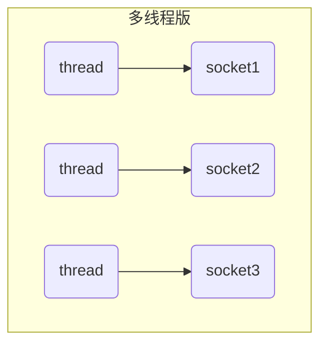
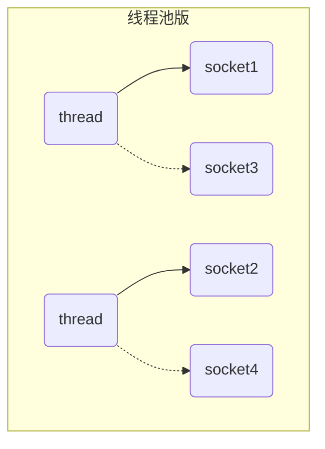
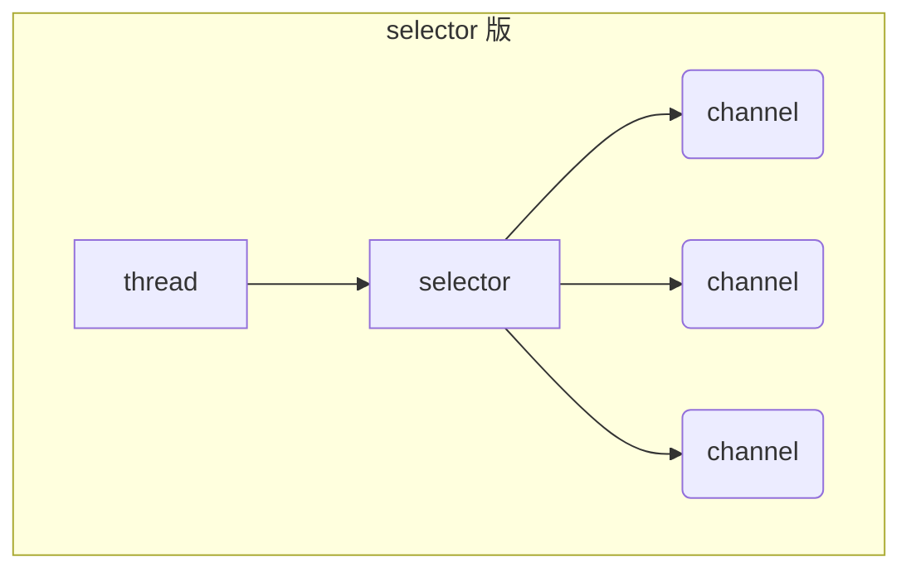

+++
title = "[Java]NIO1三大组件"
date = "2024-07-12T09:51:47+08:00"
tags = ["Java","Netty"]

+++

NIO non-blocking io 非阻塞 IO  

BIO blocking io 阻塞IO

## 0.流与块

Standard IO是对字节流的读写，在进行IO之前，首先创建一个流对象，流对象进行读写操作都是按字节 ，一个字节一个字节的来读或写。而NIO把IO抽象成块，类似磁盘的读写，每次IO操作的单位都是一个块，块被读入内存之后就是一个byte[]，NIO一次可以读或写多个字节。

I/O 与 NIO 最重要的区别是数据打包和传输的方式，I/O 以流的方式处理数据，而 NIO 以块的方式处理数据。

**面向流的 I/O** 一次处理一个字节数据：一个输入流产生一个字节数据，一个输出流消费一个字节数据。为流式数据创建过滤器非常容易，链接几个过滤器，以便每个过滤器只负责复杂处理机制的一部分。不利的一面是，面向流的 I/O 通常相当慢。

**面向块的 I/O** 一次处理一个数据块：按块处理数据比按流处理数据要快得多。但是面向块的 I/O 缺少一些面向流的 I/O 所具有的优雅性和简单性。

## 1. 三大组件

### 1.1 Channel & Buffer

channel （通道）有一点类似于 stream，它就是读写数据的**双向通道**，可以从 channel 将数据读入 buffer（缓冲区，用于存储数据的内存块，是NIO中的数据容器），也可以将 buffer 的数据写入 channel，而之前的 stream 要么是输入，要么是输出，channel 比 stream 更为底层。

常见的 Channel 有

* FileChannel：文件传输通道
* DatagramChannel：UDP时传输通道
* SocketChannel：TCP时传输通道，客户端服务器端都能用
* ServerSocketChannel：TCP时传输通道，服务器端

buffer 则用来缓冲读写数据，常见的 buffer 有

* **ByteBuffer**
  * MappedByteBuffer
  * DirectByteBuffer
  * HeapByteBuffer
* ShortBuffer
* IntBuffer
* LongBuffer
* FloatBuffer
* DoubleBuffer
* CharBuffer

### 1.2 Selector

选择器用于监控多个通道的IO事件，当一个或多个事件发生时，选择器会通知对应的通道进行处理。使用选择器可以实现单线程处理多个通道的IO操作，提高系统的并发性能。

selector（选择器） 单从字面意思不好理解，需要结合服务器的设计演化来理解它的用途

#### 多线程版设计

#### ⚠️ 多线程版缺点

* 内存占用高
* 线程上下文切换成本高
* 只适合连接数少的场景

#### 线程池版设计

#### ⚠️ 线程池版缺点

* 阻塞模式下，线程仅能处理一个 socket 连接
* 仅适合短连接场景（短连接指的是在数据传送过程中，只在需要发送数据时，才去建立一个连接，数据发送完成后，则断开此连接，即每次连接只完成一项业务的发送）

#### selector 版设计

selector 的作用就是配合一个线程来管理多个 channel，获取这些 channel 上发生的事件，这些 channel 工作在非阻塞模式下，不会让线程吊死在一个 channel 上。适合连接数特别多，但流量低的场景（low traffic）

调用 selector 的 select() 会阻塞直到 channel 发生了读写就绪事件，这些事件发生，select 方法就会返回这些事件交给 thread 来处理。
